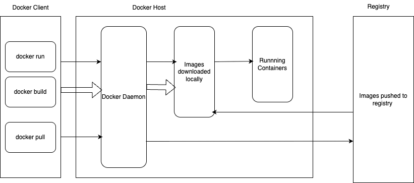

### Docker and Docker Compose
---------

## Docker

---------

It is a platform for Building, Running and Managing Containers.

 ## Container:-
It is a lightweight, portable, isolated and self sufficient software package that includes everything an application needs to run(its code, dependencies,system libraries,runtime and settings). 

## Virtual Machine(VM) vs Container

## Docker Architecture

Docker CLI ---> DockerD ----> ContainerD ---> Containerd-shim ----> runc

Docker CLI:-

docker CLI communicates with Docker daemon via unix socket(/var/run/docker.sock) using the docker REST APIs if both the docker cli and docker daemon are on the same host.

docker cli communicates with docker daemon via TCP://0.0.0.0:2376 using REST APIs if both are on remote setup. But this very rare now as the orchestrators came to picture they are using the run time to decide how and where to deploy the containers. i.e locally they are building the images and pushing into repo and the runtimes are pulling the images and runnig as containers.

Docker Daemon (dockerd):-

dockerd analyze the Dockerfile or image, setting up the mounts, network config, volumes etc and creats the container's OCI bundle(config.json + rootfs). Then talks to Containerd runtime via gRPC to create and start the container. Dockerd applies the docker specific logic.

Containerd :-

The Containerd manages the containers as "Tasks". Once it receives the call from Dockerd it initiates the lightweight , dedicated process to manage and interact with that specific container. the process is called continerd-shim

Containerd-shim:-

The Shim then setup the STDIO(STDIN,STDOUT,STDERR) to the appropriate streams to collect the output from containers to containerd.
Also setup the runtime environment and prepares the filesystem.ie.mounts the container root filesystem, setup the namespaces(PID,mount,network etc), configure cgroups(CPU,memory etc).
Now calls the RUNC by executing the command runc run <container-id>

Containerd-shim will be there till the container exists as it the one which will monitor and allow the STDIO operations. it will give the status of the container to containerd. so if the containerd crashes also it will not effect the running container. once the containerd is up and back again it will get the container information about the running containers from containerd-shim and update accordingly.

if the containerd-shim crashes, then the running container will become orphan process. So the contianerd wont be able to find them out.

runc:- 
 runc then reads the OCI spec created by dockerd and execute the syscall clone() to create 
   1. namespaces
   2. cgroups
   3. apply rootfilesystem.
   4. Network

   once the process is created then the runc exits and the shim will takecare of the container.

## namespaces:-

## Cgroups:-

## DockerFile :-

Dockerfile is a text file that contains a set of instructions which is used to create the docker image. It acts as a blueprint defining all the steps needed to create an image, including the operating system, application code, libraries and dependencies. 

When you run the docker build command, docker reads the instructions from the docker file and creates the image.

# Dockerfile components

FROM. ---> To get the base image
ENV -- > To define environment varaibales
RUN  ---> To run the commands
WORKDIR. ----> To create the work directory inside the container
COPY. ----> To copy the code or files to traget directory
VOLUME  ----> To create the persistent data by creating the volumes and mount
EXPOSE. ----> To expose the application at particular port to outside world
CMD  ---> To set the default command to execute when the container run. if we provide any arguments during the docker run command it will replace the CMD. 
ENTRYPOINT ----> when we provide the arguments during the docker run the values get appended to Entrypoint and run in the container. if no values are provided then it will take CMD values as the default. Entrypoint is fixed.To change/override the Entrypoint we need to use --entrypoint.

## Tips to write the better Dockerfile
   To Optimize the docker layer caching we always need to follow the below order.
# System setup -- OS level dependencies.
     # base image setup
     # updating and installing the system level config
# Application setup -- Application dependencies
    # setup the workdir
    # copy the requirements to workdir
    # install the requirments
# Code setup --- copying the application and config
    # copy the code to workdir
# Runtime setup --- ports, cmd/entrypoint
    # expose and run the application

## Multi-stage Docker file

Multi stage Dockerfile allows to 
  1. reduce the size of the image
  2. Keeps the image clean and Secure
  3. separate the build dependencies from runtime
  4. improves the caching

### Docker image:-
 Docker image is a immutable, read-only templete which is used to create containers.
 Containers add a writable layers on top of image layers.

## what does docker run command do?

   1. Check for the image locally(pulls from dockerhub if missing)
   2. Creates the container metadata(ID,Name,Mounts,Network)
   3. Creates a writable layer (overlay2)
   4. Creates container network 
   5. Applies Namespaces and Cgroups
   6. Starts the process
 

## Docker Volumes & Data Persistence 

  Container are ephemeral. So the data stored on the container will be destroyed when the container exits.
  To keep the data even after the contianer exits we will create an external volume or bind mounts and mount them to the continers. The data is stored to them. This data can be used/accessed even after the container exits.

  The docker volumes are generally located under /var/lib/docker/volumes/ . It is maintained by Docker and it is portable. i.e which ever the host we run the docker it will have the same file system across and also docker work the same on all OS(linux,windows).

  Bind mount are not portable because it sticl to the path and manually managed. when ever the container is moved to different hosts, the same file system should exists else it will through an error. Also the file systems are different across the different OS.

  Note: For production environment, Volumes are the recommended mechanism to persistent the data for their portability and managed by docker.

## Docker Network 

 Docker network is communication channel that enables the interaction between containers, host machines and also the external networks.   

 It is built on Namespaces, Virtual ethernet pair(veth) and bridge.

 namespace: Every container gets its own network namespace i.e Ip address, firewall rules, routing table and network interface. This makes the container isolated and secure.
 Virtual ethernet pair(veth) : it is like a virtual cable which connects the container and host.
 Bridge : docker create the virtual bridge called docker0. All the containers on the default network will connect to it.

Docker networks : 
   1. Bridge Network
   2. Host Network
   3. None Network
   4. User-defined Bridge Network

   Bridge network:-

    Docker run -d nginx

     This is the default network of the docker. It will create the veth pair and connects one end to container and other end to docker0(virtual stwitch/bridge). Also gives an IP address to the contianer.
     Here container use internal IPs to talk eachother. For Outside communication they use NAT.

   Host Network:- 

    Docker run --network host nginx

    No network isolation. Containers use the host's network namespace. So no seperate IP address. Fastest network performance.

    Useful for - high perfomance networking tools, promotheus exporters. 

   None Network:-

    docker run --network none nginx

    these contianers dont have external connectivity, loop back only. no bridge or Ip address.

    Useful for -- security isolation, Testing.

   User-defined bridge network:-

    docker network create mynet

    docker run --network mynet nginx

     Here the user will create a network bridge. Docker will create a linux bridge, a subnet and gateway, and also an Iptables  NAT rule for outside communication.

      each container gets a veth pair and a IP address from the subnet.

       All the containers which add into this network can access through container names(docker embedded DNS resolver resolves container names to continer IPs).
    Advantages of user-defined:
      1. Automatic container DNS
      2. Better network isolation
           each network is a seperate LAN. Containers in netA cannot talk to containers in netB unless connect them.
      3. Easier to manage micro services.
           Here we can create a seperate groups for different containers.
            ex: front-end net for UI
                backend net for DB
                shared net for gateways
      4. fully controlled Subnets & gateways
            while creating the network you can specify the subnet and gateways.
             ex: docker network create --subnet 10.10.10.0/16 --gateway 10.10.0.1 backend

      5. built-in NAT to access the internet
           containers get outbound internet via NAT on host. 

Note: For Production, always use user-defined bridge network for better isolation, automatic DNS and fully controlled subnets and gateways.

  

